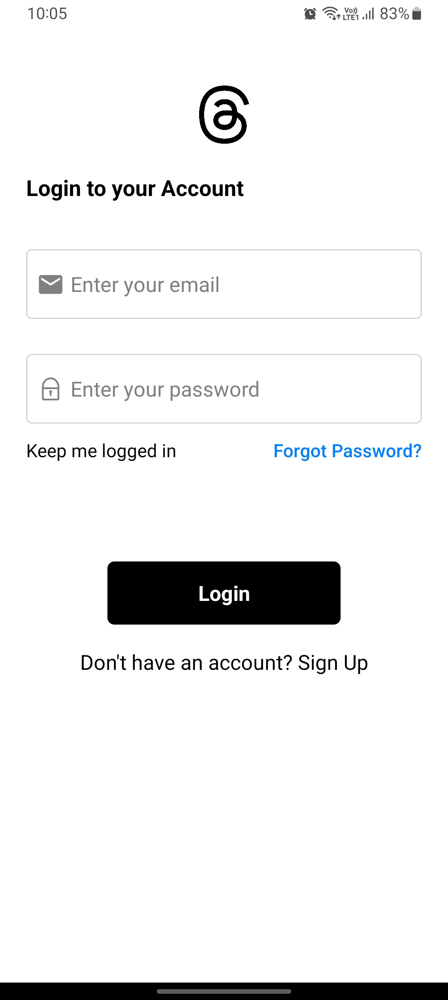
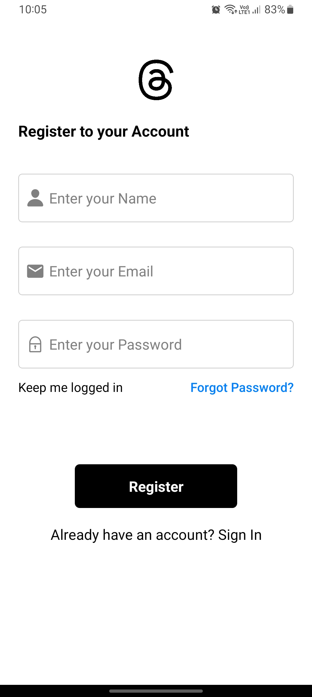
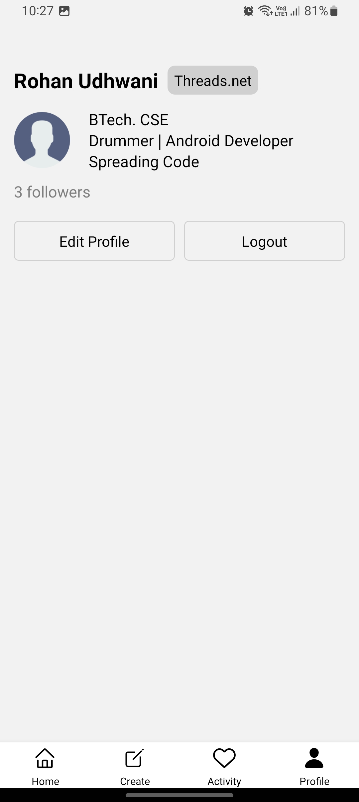
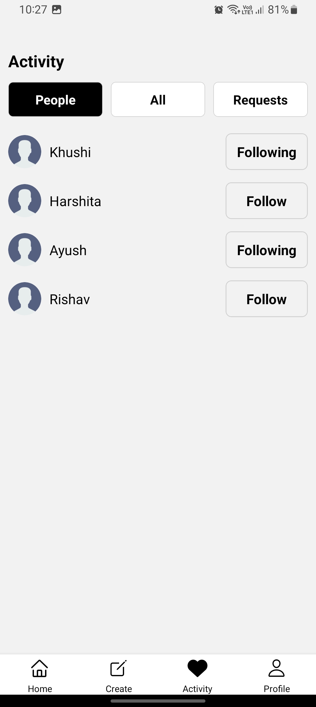
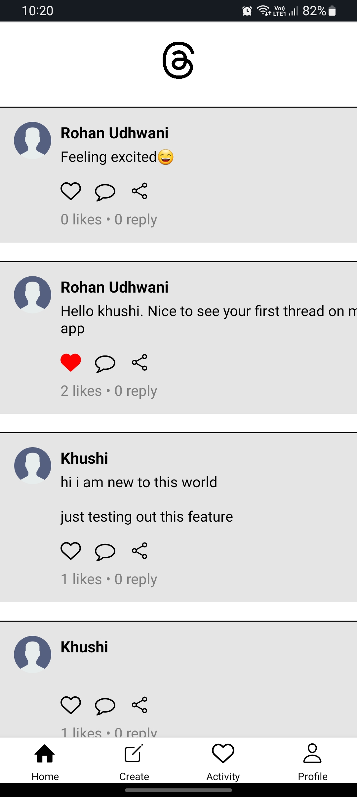

# Threads

<p align="center">
  
</p>

## Installation

To run the Threads app on your device, follow these steps:

1. Clone this repository to your local machine:
   ```bash
   git clone https://github.com/rohanudhwani/Threads.git
   ```

2. Navigate to the API directory:
   ```bash
   cd Threads/api
   ```

3. Start the API server:
   ```bash
   yarn start
   ```

4. Obtain your PC's IP address using the command prompt:
   ```bash
   ipconfig
   ```

5. Set the necessary links in the app to your PC's IP address.

6. Run the Threads app on your device:
   - Download and install the app from [Threads.apk](https://github.com/rohanudhwani/Threads/raw/master/Threads.apk).

## Features

- Secure sign-up using email with email verification.
- Login with improved security using Json Web Tokens (JWT).
- Profile screen for user information and settings.
- Activity screen to discover and follow/unfollow other users.
- Create thread screen to post new content.
- Feed screen displaying threads by the user and others.

## Screenshots

| Login | SignUp | Profile | Activity | Create Thread | Feed |
| --- | --- | --- | --- | --- | --- |
|  |  |  |  |  |  |
| --- | --- | --- | --- | --- | --- |
| Login screen for authentication | Sign-up screen with email verification | User profile and settings screen | Activity screen to follow/unfollow users | Create Thread screen for posting content | Feed screen displaying user and other threads |


## Getting Started

Ensure you have Expo installed:
```bash
npm install -g expo-cli
```

Navigate to the Threads project directory:
```bash
cd Threads
```

Install dependencies:
```bash
npm install
```

Run the app:
```bash
npx expo start
```

Scan the QR code with the Expo Go app to launch Threads on your device.

## Feedback and Contributions

Feel free to provide feedback or contribute to the Threads app by creating issues or pull requests in this repository. Your input is valuable, and we appreciate any contributions to make Threads even better!
